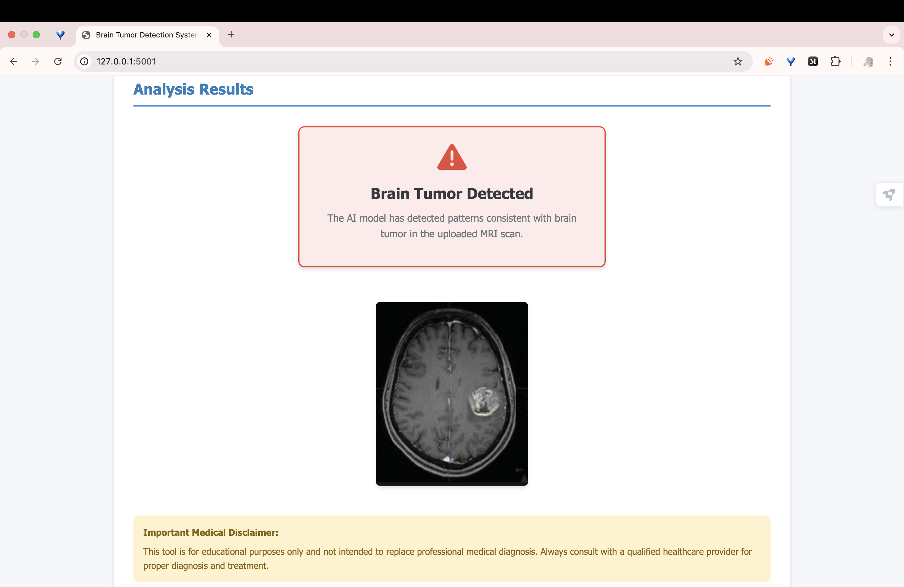

# 🧠 Tumor Detection Web App

A web-based application to detect tumors from medical images using AI. This tool is designed to support early diagnosis and provide a simple interface for both healthcare professionals and researchers.

## 🚀 Features

- 🖼️ Upload medical images (e.g., MRI, CT scan)
- 🤖 Tumor detection using a trained deep learning model
- 📊 Shows prediction results with confidence scores
- 🧪 Tested on real datasets for accuracy and reliability
- 📱 Mobile-friendly and responsive UI
- 🔐 Secure handling of uploaded images (no permanent storage)

## 🛠️ Tech Stack

- **Frontend**: HTML, CSS, JavaScript (or React if applicable)
- **Backend**: Python (Flask / FastAPI / Django)
- **AI Model**: TensorFlow / Keras / PyTorch
- **Deployment**: Heroku / Vercel / Render / Local server

## 📂 Project Structure
tumor-detection-web/
├── static/                 # CSS, JS, images
├── templates/              # HTML templates
├── Lenet_Model.h5                  # Saved AI model (.h5 / .pt)
├── app.py                  # Flask or FastAPI backend
├── requirements.txt        # Python dependencies
└── README.md               # This file
## 🧪 How to Run Locally

1. **Clone the repository**
git clone https://github.com/yourusername/tumor-detection-web.git
cd tumor-detection-web

2. **Create a virtual environment**
python -m venv venv
source venv/bin/activate   # On Windows: venv\Scripts\activate

3. **Install dependencies**
pip install -r requirements.txt

4. **Run the app**
python app.py

Then open your browser and go to `http://localhost:5000`

## 📸 Screenshot

## 🧠 AI Model

The model used is a **LeNet Convolutional Neural Network (CNN)** trained on MRI brain images labeled with "tumor" and "no tumor" classes.  
The trained model is saved as `model/lenet_model.h5`. You can replace this file with your own LeNet-based model if needed.

## 🙋‍♀️ Author

Created with ❤️ by [Ladya Kalascha](https://github.com/ladyfanning001)  
For support or collaboration, feel free to reach out!

## 📄 License

This project is licensed under the MIT License.

